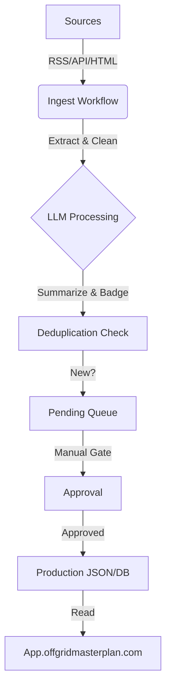

# n8n Automation Architecture: Success Stories Ingestion

**Purpose:** Automatically fetch, validate, and queue off-grid field reports for human approval, ensuring content freshness without manual hunting.

## Architecture Diagram



## Workflow: `STORIES_INGEST_V1`

### 1. Triggers (Schedule)
- **Frequency:** Weekly (Monday 09:00 UTC)
- **Reasoning:** High-quality builds aren't posted hourly; weekly prevents noise.

### 2. Sources (Input Nodes)
- **Permies.com:** Scrape specific "Field Reports" forums (HTML Extract).
- **YouTube:** Channels like *Living Big in a Tiny House*, *Happen Films* (YouTube API).
- **Reddit:** r/OffGrid, r/Homestead (RSS).
- **Earthship Biotecture:** News/Blog feed (RSS).

### 3. Processing (LLM Node - GPT-4o-mini / Claude 3 Haiku)
- **Prompt:**
  > "Extract the following from this content:
  > 1. Project Name (Person or Build Name)
  > 2. Location (City/State/Country)
  > 3. Key Systems (Solar, Water, Waste)
  > 4. 'Win' Factor (What makes it special?)
  > 5. 3 Badges from [Solar, Wind, Rainwater, Permaculture, TinyHouse, Earthship, Legal, DIY]
  > Output JSON."

### 4. Deduplication
- **Key:** `hash(source_url)` OR `hash(title + location)`
- **Action:** If exists in `published_stories.json` or `pending_queue`, SKIP.

### 5. Storage (Pending Queue)
- **Location:** `data/pending_stories.json` (or a simple Baserow/Airtable row).
- **Structure:**
  ```json
  {
    "id": "yt_video_ID",
    "title": "Shipping Container in the Alps",
    "location": "Swiss Alps",
    "badges": ["DIY", "Solar", "Insulation"],
    "summary": "Converted 40ft container using spray foam...",
    "source_url": "https://youtube.com/...",
    "status": "pending"
  }
  ```

### 6. Human Approval (The Gate)
- **Interface:** Telegram Bot or Email Digest.
- **Actions:**
  - [Approve]: Moves to `success_stories.json`.
  - [Edit]: Opens simple form to tweak text.
  - [Reject]: Discards.

## Integration with App
- **Current State:** Hardcoded in `Home.tsx`.
- **Future State:**
  - `Home.tsx` fetches `https://app.offgridmasterplan.com/data/success_stories.json`.
  - This JSON is statically generated/updated by the n8n workflow committing to the repo (Git integration).

## Implementation Steps
1. Create `data/success_stories.json` in the repo to replace hardcoded array.
2. Build n8n workflow to append to this file via Git (or PR).
3. Update `Home.tsx` to `fetch()` this JSON.
